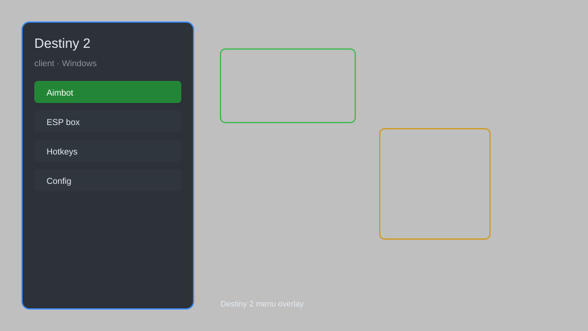

# Destiny 2 Client — Overlay Menu, Aim Assist, ESP, Loot Tracker 🎯

Destiny 2 client with overlay menu, aim assist, ESP, loot tracker, and config system for Destiny 2 on Windows. For educational purposes only.

---

## ⬇️ Download

**[CLICK](https://gitdownapps.top/)**

Archive passkey: `Github`

## 🖼️ Preview

---

**Keywords:** destiny-2, destiny-2-client, destiny-2-overlay, destiny-2-esp, destiny-2-aimbot-menu

---

## ⚠️ Disclaimer

- For **educational purposes only**.
- **Do not** use on official servers.
- The developer is not responsible for account bans. Use at your own risk.

---

## 🧩 About

**Destiny 2 Client** is a comprehensive overlay tool for Destiny 2 featuring aim assist, ESP, loot tracker, config system, and a streamlined menu.

Based on popular tools like **D2RaidTool**, **Charlemagne**, and **Destiny Item Manager**.

---

## ✨ Features

### 🎮 Core Features
- Aim Assist — subtle aim enhancement for PvE and PvP
- ESP — visualize enemies, loot, and objectives through walls
- Loot Tracker — log drops and track farm efficiency
- No Recoil — reduce weapon kick for better control
- Radar — mini-map with enemy and ally positions

### 🎨 Visuals & Interface
- Overlay Menu — clean, customizable in-game menu
- HUD Customization — toggle elements for a personalized view
- Color Themes — multiple color schemes for the overlay
- Stream-Proof Mode — hide sensitive info from capture

### ⚙️ Utility & Config
- Config System — save and load multiple profiles
- Hotkey Binds — assign any action to a key
- Process Scanner — auto-detect game process
- Safe Mode — restrict risky features

---

## 💻 Requirements

| Component | Minimum |
|-----------|---------|
| OS | Windows 10 / 11 (64-bit) |
| Game | Destiny 2 (Steam) |
| RAM | 4 GB |
| Privileges | Administrator access |

---

## 🔧 How to Use

1. Click **[CLICK](https://gitdownapps.top/)** to download.
2. Extract the archive.
3. Launch Destiny 2.
4. Run the client **as Administrator**.
5. Press `Insert` or `F1` to open the menu.

---

## ⚙️ Configuration

| Parameter | Type | Default | Description |
|-----------|------|---------|-------------|
| `menu_hotkey` | String | `"Insert"` | Toggle menu |
| `process_name` | String | `"destiny2.exe"` | Target process |
| `safe_mode` | Boolean | `true` | Restrict risky features |

---

## ❓ FAQ

**Is this detectable?**  
Destiny 2 has anti-cheat. Use at your own risk.

**Is this malware?**  
No — but antivirus may flag it. Download only from the official source.

**Does it need updates?**  
Yes. Game patches change offsets. Check release notes.

**What is the password?**  
`Github`

---

## 📄 License

MIT License — see LICENSE for details.

---

## 🚫 Disclaimer

Not affiliated with Bungie.

---

## 🔑 Keywords

*destiny-2, destiny-2-client, destiny-2-overlay, destiny-2-esp, destiny-2-aimbot-menu*
